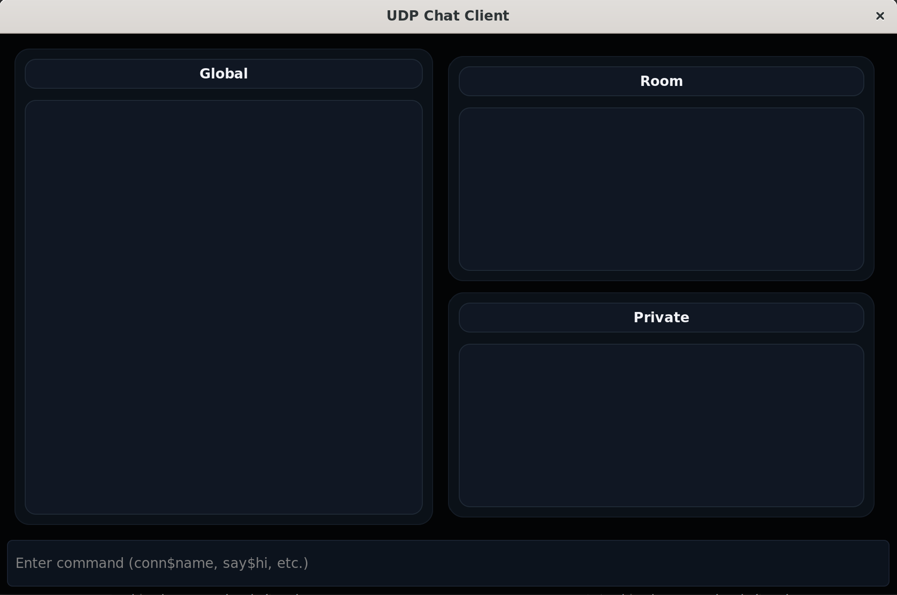

# Multithreaded Chat Application

A multithreaded client–server chat system written in **C**, featuring:

- **GTK-based GUI client** for a modern conversation view  
- **UDP networking** for response/requests
- **Circular message queue** for replaying recent history  
- **Min-heap** for automatic removal of inactive clients
- **Chat rooms** for talking to specific members

## Preview



---

## Table of Contents

1. [Overview](#overview)  
2. [Repository Layout](#repository-layout)  
3. [Dependencies, Building & Running](#dependencies-building--running)  
   - [Requirements](#requirements)  
   - [Build Commands](#build-commands)  
   - [Run Commands](#run-commands)  
4. [Core Functionality](#core-functionality)  
5. [Command Reference](#command-reference)  
6. [Visualisations](#visualisations)  
7. [Proposed Extensions](#proposed-extensions)
8. [Further Enhancements](#further-enhancements)

---

## Overview

- Multithreaded UDP server dispatching per-request worker threads  
- GTK client with separate panes for global, room, and private logs  
- Circular queue (PE1) to replay recent history on connect  
- Min-heap monitor (PE2) to ping and remove inactive clients
- Chat rooms (FE1) to send messages to a group of clints

---

## Repository Layout

```
Multithreaded-Chat/
├── activity_heap.c/.h    # Min-heap for inactivity tracking (PE2)
├── chat_client.c         # GTK client implementation
├── chat_server.c/.h      # Server logic + state
├── circular_queue.c/.h   # Message history buffer (PE1)
├── room.c/.h             # Chat rooms (FE1)
├── udp.h                 # UDP socket helpers
├── logs/                 # Client log outputs
├── client / server       # Convenience launchers
└── Preview.png           # GUI screenshot
```

---

## Dependencies, Building & Running

### Requirements

- **GCC / Clang** (C11)
- **POSIX threads (pthread)**
- **GTK+ 3.0 & pkg-config** (client build)

#### Installing GTK+ (Ubuntu/Debian)

```bash
sudo apt update
sudo apt install build-essential pkg-config libgtk-3-dev
```

#### Installing GTK+ (Fedora)

```bash
sudo dnf install @development-tools pkgconf-pkg-config gtk3-devel
```

On macOS, install via Homebrew: `brew install gtk+3`.

### Build Commands

**Server**
```bash
gcc chat_server.c circular_queue.c activity_heap.c room.c -lpthread -o server
```

**Client (GTK UI)**
```bash
gcc chat_client.c -lpthread $(pkg-config --cflags --libs gtk+-3.0) -o client
```

### Run Commands

**Start the server**
```bash
./server
```

**Launch a client**
```bash
./client [server_ip] [client_port]
```

- `server_ip` defaults to `127.0.0.1`
- `client_port` defaults to `0` (choose a fixed port like `./client 192.168.1.50 6001` if needed)

Multiple clients may run simultaneously; logs land in `logs/`.

---

## Core Functionality

- Multithreaded server processes each UDP request on a detached worker thread.  
- Circular queue stores the last 15 broadcasts; newcomers receive this history on `conn$`.  
- Clients can broadcast, direct-message, rename, mute/unmute, disconnect, or request admin kicks.  
- GTK client logs all messages to disk and scrolls logs automatically.  
- Inactivity monitor: the server tracks `last_active` timestamps in a min-heap and pings stale clients automatically.

---

## Command Reference

| Command | Description |
| ------- | ----------- |
| `conn$ <name>` | Connect to the server with the chosen username |
| `say$ <msg>` | Broadcast a message to everyone |
| `sayto$ <recipient> <msg>` | Send a private message |
| `mute$ <name>` | Ignore messages from a user |
| `unmute$ <name>` | Remove an existing mute |
| `rename$ <new_name>` | Change your username |
| `disconn$` | Disconnect cleanly |
| `kick$ <name>` | **Admin-only (port 6666)** – eject a user |
| `ping$` / `ret-ping$` | Keepalive pair used by PE2 (responses handled automatically by the client) |

> **Design Choice**  
> All commands are parsed inside a single `handle_request()` function (despite brief) that runs in a dedicated worker thread per incoming packet. Because each packet already spawns its own thread, dispatching again per command would only multiply thread overhead without reducing lock contention. Keeping the logic centralized makes it easy to add new commands while still processing requests concurrently.

---

## Visualisations

The GTK client renders three scrollable panes—**Global**, **Room**, and **Private**—so activity stays organized. Incoming messages are appended on the GTK main loop via idle callbacks, ensuring thread-safe UI updates. Each log panel uses consistent styling (dark theme, rounded sections) to highlight the current conversation and provide an at-a-glance chat history.

---

## Proposed Extensions

### PE1 – Circular Queue

The server keeps the last 15 global messages in a circular buffer (`circular_queue.c`). New arrivals replay this history immediately after connecting, giving them context without overloading the network. Enqueue operations are O(1), and the queue automatically overwrites the oldest entry when full.

### PE2 – Remove Inactive Clients

A thread-safe min-heap (`activity_heap.c`) stores `(last_active, client)` pairs ordered by timestamp. A dedicated ping monitor thread:

1. Peeks at the oldest entry.  
2. Sends `ping$` if the client has been idle for 5 minutes.  
3. Removes the client if no `ret-ping$` arrives within 10 seconds, broadcasting a notice.

All heap updates occur while holding the existing `pthread_rwlock_t`, so this extension remains thread safe—request handlers, client removal, and the monitor never manipulate the heap concurrently without the lock.

---

## Further Enhancements

### Chat Rooms & Message Tags

We introduced chat rooms with their own message buffers and membership lists. The server exposes new room-specific commands that reuse the same text-based protocol:

| Command | Description |
| ------- | ----------- |
| `createroom$ <room>` | Create a room (fails if the name already exists) and join it immediately |
| `joinroom$ <room>` | Join an existing room. Users must leave their current room first. Sees recent history |
| `leaveroom$` | Leave the currently joined room. The room is destroyed when its last member leaves |
| `sayroom$ <msg>` | Send a message only to users in the same room |
| `kickroom$ <user>` | **Admin-only (port 6666)** – remove a user from their room (but keep them connected globally) |

Messages carry a 2-bit prefix so the client can route them to the correct pane and log file:

- `00` – global traffic  (`logs/global.txt`)
- `01` – room traffic    (`logs/room.txt`)
- `10` – private traffic (`logs/priv.txt`)

This approach lets the GTK client style output differently for each channel and keep the disk logs separated without extra parsing.
