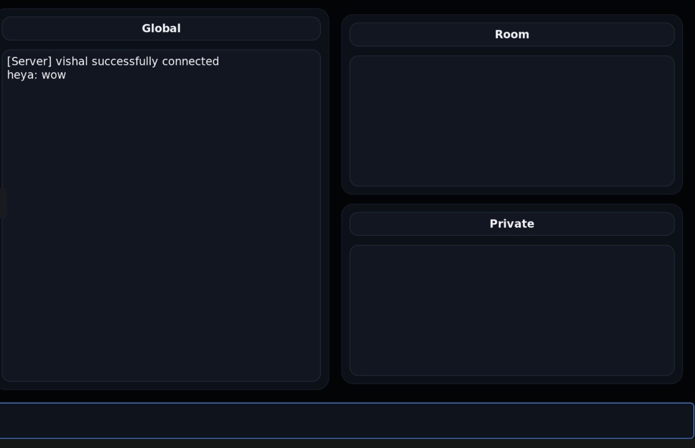

# Multithreaded Chat Application

A multithreaded client–server chat system written in **C**, featuring a **GTK-based graphical client interface**, **UDP networking**, and a **custom circular message queue** to maintain recent chat history.

## Preview



---

# Table of Contents

1. [Repository Layout](#repository-layout)  
2. [Building & Running](#building--running)  
3. [Core Functionality](#core-functionality)  
4. [Command Execution](#command-execution)  
5. [Circular Queue (PE1)](#circular-queue-pe1)  
6. [Proposed Extensions](#proposed-extensions)  
7. [Dependencies](#dependencies)

---

# Repository Layout

MULTITHREADED-CHAT/
├── chat_client.c        # GTK client implementation
├── chat_client          # Compiled client binary
├── chat_server.c        # Server source code
├── chat_server.h
├── chat_server          # Compiled server binary
├── circular_queue.c     # Circular queue implementation (PE1)
├── circular_queue.h
├── udp.h                # Networking utilities
├── client               # Optional client launcher
├── server               # Optional server launcher
└── iChat.txt            # Test logs / example chat logs


## Building the Client (GTK UI)

Requires **GTK+ 3.0**.

### Compile Command:
```
gcc chat_client.c -lpthread $(pkg-config --cflags --libs gtk+-3.0) -o client
```

---

## Building the Server

### Compile Command:
```
gcc chat_server.c circular_queue.c -lpthread -o server
```

---

## Running the Application

### Start the server:
```
./server
```

### Launch a client:
```
./client
```

Multiple clients may run simultaneously.
```

***

# Core Functionality

## Client–Server Workflow

Clients communicate with the server using custom text-based commands.

The server supports:

- Broadcasting messages
- Private messaging
- Username management
- Muting/unmuting users
- Sending recent message history
- Multithreaded client handling

---

# Command Execution

Command Format | Description
-------------- | -----------
conn$ client_name | Connect to the server with a username
say$ msg | Broadcast a message to all users
sayto$ recipient_name msg | Send a private message to a specific user
mute$ client_name | Mute a user
unmute$ client_name | Unmute a user
rename$ new_name | Change your username
disconn$ | Disconnect from the server
kick$ client_name | **Admin only:** forcefully disconnect a user

---

# Circular Queue (PE1)

A **fixed-size (15 messages)** circular queue is implemented on the server to store recent chat history.

## Properties

- `head` points to the **oldest** stored message  
- `tail` points to the **insertion index (newest + 1)**  
- When full, inserting a new message **overwrites the oldest**  
- Enqueue operation is **O(1)**  

## Purpose

When a new client connects, the server immediately sends the most recent messages as chat history.

---


# Dependencies

- **C (GCC)**
- **POSIX Threads (pthread)**
- **GTK+ 3.0** (client)
- **pkg-config** (for GTK build flags)
